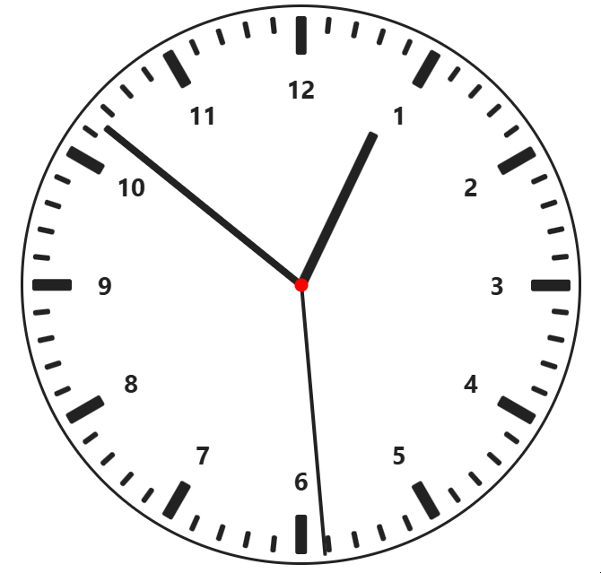

<div align="center" width="100%">
  
</div>

# ngx-analog-clock

[](https://www.npmjs.org/package/ngx-analog-clock/)
[](https://www.npmjs.org/package/ngx-analog-clock/)
[](https://github.com/DerStimmler/ngx-analog-clock/blob/main/LICENSE.md)

Angular library for easier use of the View Transitions API

## Demo

https://derstimmler.github.io/ngx-analog-clock/

## Installation

Available on [npm](https://www.npmjs.org/package/ngx-analog-clock/).

```bash
npm install ngx-analog-clock
```

Required Angular version: `>=19.0.0`

## Usage

Import the component:

```typescript
import { NgxAnalogClock } from 'ngx-analog-clock';

date = new Date();
```

Provide at least a `Date` object to the component:

```angular2html
<ngx-analog-clock [date]="date"></ngx-analog-clock>
```

> [!TIP]
> To get a `Date` signal of the current local time that updates every second you can use this snippet:
> ```typescript
> import { toSignal } from '@angular/core/rxjs-interop';
> import { map, interval } from 'rxjs';
> 
> date = toSignal(interval(1000).pipe(map(() => new Date())), { initialValue: new Date() });
>```

### Configuration

| Input                      | Description                                      | Default Value                    |
|----------------------------|--------------------------------------------------|----------------------------------|
| `date`                     | Current date/time driving the clock              | **Required**                     |
| `showHourHand`             | Toggle visibility of the hour hand               | `true`                           |
| `showMinuteHand`           | Toggle visibility of the minute hand             | `true`                           |
| `showSecondHand`           | Toggle visibility of the second hand             | `true`                           |
| `showHourMarkers`          | Show hour tick markers                           | `true`                           |
| `showMinuteMarkers`        | Show minute tick markers                         | `true`                           |
| `showClockNumbers`         | Display clock face numbers                       | `true`                           |
| `showBezel`                | Show outer bezel (rim)                           | `true`                           |
| `transitionDuration`       | Duration of hand movement transitions            | `'0.5s'`                         |
| `transitionFunction`       | CSS transition timing function for hand movement | `'cubic-bezier(0.4, 2, 0.3, 1)'` |
| `bezelThickness`           | Thickness of the bezel                           | `'3px'`                          |
| `pivotThickness`           | Size of the pivot (center cap)                   | `'12px'`                         |
| `hourHandThickness`        | Thickness of the hour hand                       | `'9px'`                          |
| `hourHandLength`           | Length of the hour hand relative to radius       | `'60%'`                          |
| `minuteHandThickness`      | Thickness of the minute hand                     | `'6px'`                          |
| `minuteHandLength`         | Length of the minute hand relative to radius     | `'90%'`                          |
| `secondHandThickness`      | Thickness of the second hand                     | `'3px'`                          |
| `secondHandLength`         | Length of the second hand relative to radius     | `'97%'`                          |
| `pivotColor`               | Color of the pivot                               | `'#ff0000'`                      |
| `hourHandColor`            | Color of the hour hand                           | `'#222222'`                      |
| `minuteHandColor`          | Color of the minute hand                         | `'#222222'`                      |
| `secondHandColor`          | Color of the second hand                         | `'#222222'`                      |
| `hourMarkerColor`          | Color of the hour markers                        | `'#222222'`                      |
| `minuteMarkerColor`        | Color of the minute markers                      | `'#222222'`                      |
| `clockNumberColor`         | Color of the numbers                             | `'#222222'`                      |
| `dialColor`                | Background color of the clock face               | `'transparent'`                  |
| `bezelColor`               | Color of the bezel                               | `'#222222'`                      |
| `markerOffsetPercent`      | Radial offset for markers (relative to radius)   | `96`                             |
| `numbersOffsetPercent`     | Radial offset for numbers (relative to radius)   | `70`                             |
| `hourMarkerThickness`      | Thickness of hour markers                        | `'2%'`                           |
| `hourMarkerLength`         | Length of hour markers                           | `'7%'`                           |
| `minuteMarkerThickness`    | Thickness of minute markers                      | `'1%'`                           |
| `minuteMarkerLength`       | Length of minute markers                         | `'3%'`                           |
| `hourHandBorderRadius`     | Border radius of the hour hand                   | `'2px'`                          |
| `minuteHandBorderRadius`   | Border radius of the minute hand                 | `'2px'`                          |
| `secondHandBorderRadius`   | Border radius of the second hand                 | `'2px'`                          |
| `minuteMarkerBorderRadius` | Border radius of minute markers                  | `'2px'`                          |
| `hourMarkerBorderRadius`   | Border radius of hour markers                    | `'2px'`                          |

Most color inputs like `dialColor`, `minuteHandColor` or `hourMarkerColor` are implemented as CSS `background` property. So it's also possible to use gradient or even images.

### Responsiveness

The component behaves like a normal block element and scales dynamically. So just set the `width` and `height` as you like.
